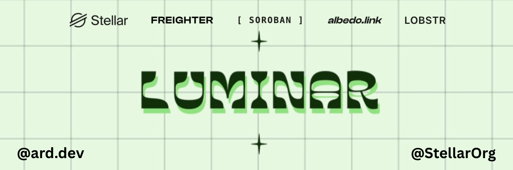
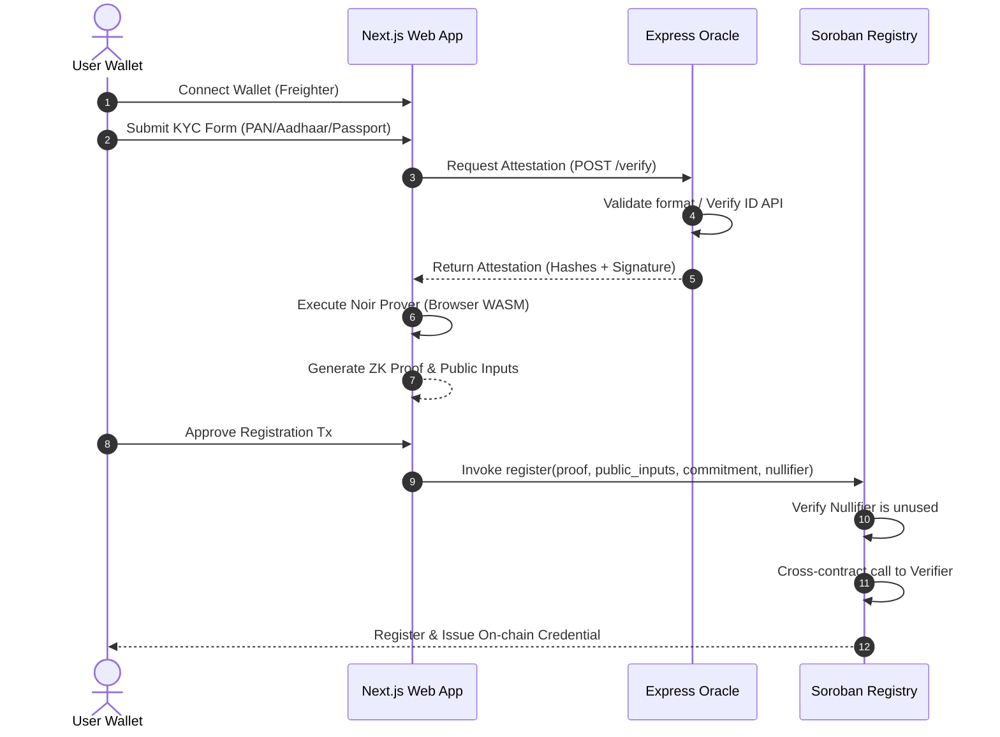

# Luminar: Decentralized Zero-Knowledge Identity Registry on Stellar



Luminar is a premium, high-fidelity, decentralized identity verification (KYC) system built on the Stellar Soroban smart contract network. By leveraging Zero-Knowledge (ZK) cryptography (Noir/UltraHonk), Luminar enables users to verify their identity credentials (such as PAN Cards, Aadhaar Cards, and Passports) and prove compliance (e.g., "Over 18") to on-chain apps **without revealing any of their personal identifiable information (PII)** or leaving a permanent data footprint.

---

## Key Features

*   **Zero-Knowledge Proofs (ZK-SNARKs)**: Powered by **Noir JS** and Aztec's **UltraHonk** proof system in the browser to compute cryptographically secure proofs of age and identification on the client side.
*   **Privacy-Preserving Registry**: Registers cryptographic commitments and nullifiers on-chain. No names, document numbers, or dates of birth are ever written to the Stellar ledger.
*   **Sybil & Double-Spend Protection**: Nullifiers prevent users from registering multiple accounts using the same physical ID card.
*   **Cryptographically Signed Oracle Credentials**: The Express-based Oracle verifies format validity (with Surepass API integrations) and signs the hashes of KYC data.
*   **Holographic Credential Card**: A premium, interactive 3D digital ID card in the frontend that flips on-click to reveal ZK commitment hashes and transaction details.

---

## Architecture Overview

Luminar is divided into four main folders:

```
├── circuits/          # Noir ZK-SNARK circuit definitions
├── contracts/         # Soroban smart contracts (Rust)
│   ├── verifier/      # Auto-generated UltraHonk proof verifier
│   └── registry/      # Main KYC registry contract
├── oracle/            # Node/Express server acting as the trusted issuer
└── frontend/          # Next.js 16 Web application (Turbopack)
```



---

## Getting Started

### Prerequisites

Ensure you have the following tools installed:
*   [Node.js (v20+)](https://nodejs.org/) & `npm`
*   [Rust & Cargo](https://rustup.rs/) (wasm32-unknown-unknown target)
*   [Stellar CLI](https://developers.stellar.org/docs/build/smart-contracts/getting-started/setup)
*   [Noir (v1.0.0-beta.9)](https://noir-lang.org/) & [BB CLI (v0.87.0)](https://github.com/AztecProtocol/aztec-packages)

---

### 1. ZK Circuit Setup (`circuits/`)
The ZK circuit validates that a user is over a specified age (`current_timestamp - dob_timestamp >= min_age_secs`) and checks that the public commitment and nullifier match the signed oracle data.

```bash
cd circuits/kyc_proof
nargo check
nargo execute

# Generate the Verification Key (VK) with Keccak Oracle
bb write_vk -b target/kyc_proof.json -o target/vk --scheme ultra_honk --oracle_hash keccak --output_format bytes_and_fields
```

---

### 2. Smart Contracts (`contracts/`)
Build and test the Soroban contracts.

```bash
# Test the Verifier contract
cd contracts/verifier/ultrahonk_soroban_contract
cargo test

# Test the Registry contract
cd ../registry/contracts/registry
cargo test
```

#### Contract Deployment
Deploy the Verifier (with the generated `vk` bytes) and the Registry (initialized to point to the verifier contract):

```bash
# 1. Deploy Verifier
stellar contract deploy \
  --wasm contracts/verifier/ultrahonk_soroban_contract/target/wasm32v1-none/release/ultrahonk_soroban_contract.wasm \
  --source alice --network testnet \
  -- --vk_bytes-file-path circuits/kyc_proof/target/vk

# 2. Deploy Registry
stellar contract deploy \
  --wasm contracts/registry/target/wasm32v1-none/release/registry.wasm \
  --source alice --network testnet

# 3. Initialize Registry
stellar contract invoke \
  --id <REGISTRY_CONTRACT_ID> \
  --source alice --network testnet \
  -- initialize \
  --owner <OWNER_ADDRESS> \
  --verifier_contract <VERIFIER_CONTRACT_ID>
```

---

### 3. Oracle Server (`oracle/`)
The oracle parses document attributes, validates formats, computes Poseidon2 field hashes, and signs them.

```bash
cd oracle
npm install

# Start the server (local development)
export ORACLE_SECRET_KEY="your-secret-key-here"
npm run dev
```
*Note: Set the `SUREPASS_TOKEN` environment variable to verify PAN cards against the Surepass API sandbox.*

---

### 4. Frontend Application (`frontend/`)
The web client handles Freighter wallet connection, runs the browser-based ZK proof generator (`@aztec/bb.js`), and submits the payload to Stellar.

Configure `.env.local` inside `frontend/`:
```env
NEXT_PUBLIC_ORACLE_URL=http://localhost:3001
NEXT_PUBLIC_REGISTRY_CONTRACT_ID=<YOUR_REGISTRY_CONTRACT_ID>
NEXT_PUBLIC_VERIFIER_CONTRACT_ID=<YOUR_VERIFIER_CONTRACT_ID>
NEXT_PUBLIC_NETWORK=testnet
```

Run the development server:
```bash
cd frontend
npm install
npm run dev
```

Visit [http://localhost:3000](http://localhost:3000) to view the application!

---

## Automated Integration Verification

We have included a script to test the entire integration flow end-to-end (Oracle attestation -> ZK witness generation -> browser-style UltraHonk proof generation with Keccak -> transaction building/simulation -> testnet submission).

To execute this test:
```bash
cd frontend
node test_onchain.js
```

---

## Security Specifications

*   **Poseidon2 Hashing**: Standard SNARK-friendly Poseidon2 permutation is used to calculate the ZK commitment hashes, keeping the constraint size low.
*   **Stellar Address Field Reduction**: Ed25519 public keys are converted into BN254 field elements through a modular reduction (`publicKeyBigInt % BN254_PRIME`) so they can be processed efficiently within the Noir circuit.
*   **Cryptographic Attestation**: The oracle produces a Secp256k1 signature over the identity parameters.
