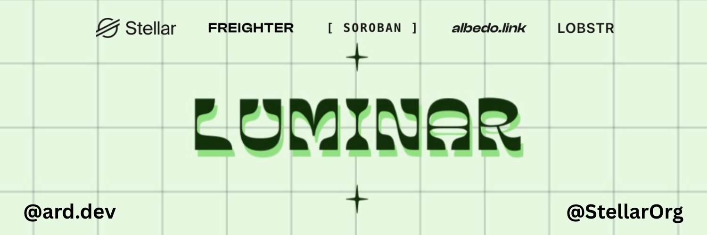
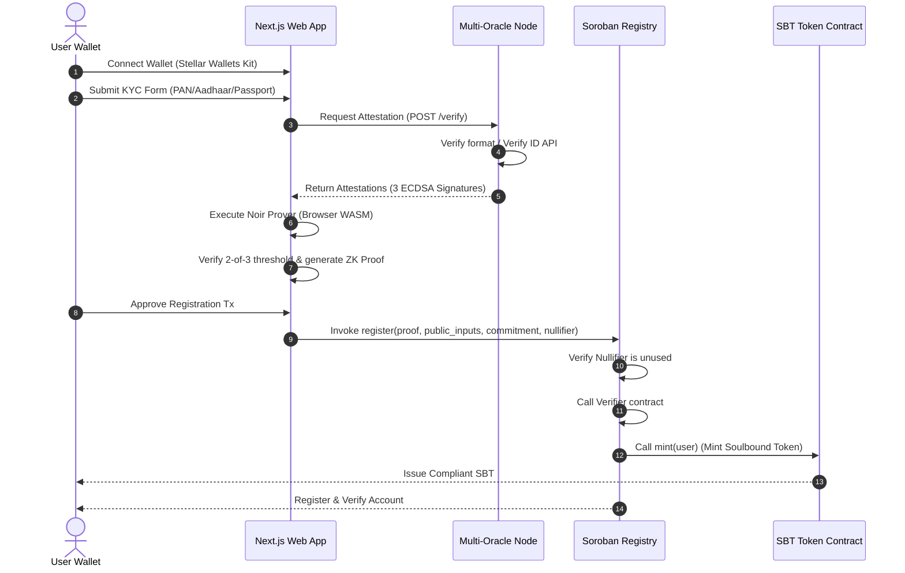

# Luminar: Decentralized Zero-Knowledge Identity Registry on Stellar



Luminar is a premium, high-fidelity, decentralized identity verification (KYC) system built on the Stellar Soroban smart contract network. By leveraging Zero-Knowledge (ZK) cryptography (Noir/UltraHonk), Luminar enables users to verify their identity credentials (such as PAN Cards, Aadhaar Cards, and Passports) and prove compliance (e.g., "Over 18") to on-chain apps **without revealing any of their personal identifiable information (PII)** or leaving a permanent data footprint.

---

## Stellar Mainnet Contract Addresses

Luminar is actively deployed on the **Stellar Mainnet**. The registry utilizes a modular architecture linking the verified cryptographic commitments to dynamic Soulbound compliance tokens.

| Contract Name | Contract ID | Explorer Link |
| :--- | :--- | :--- |
| **Luminar KYC Registry** | `CCGSPB7P2PTI7SPUN2EGWPPCGL5SGNIZ7AAVFKBTFBSIY7XCMSOKHZ4B` | [View on Stellar.expert](https://stellar.expert/explorer/public/contract/CCGSPB7P2PTI7SPUN2EGWPPCGL5SGNIZ7AAVFKBTFBSIY7XCMSOKHZ4B) |
| **ZK UltraHonk Verifier** | `CCSIAHS2UOARAAEZW5CNV2RNJNOPOPSXM7J3FT764K6E4YZZFTCE76N6` | [View on Stellar.expert](https://stellar.expert/explorer/public/contract/CCSIAHS2UOARAAEZW5CNV2RNJNOPOPSXM7J3FT764K6E4YZZFTCE76N6) |
| **Luminar Compliance SBT (LSBT)** | `CB2Y2S7N6ERY6YAC6M2KCDPVF4CSEDVEHN5OIFIUQWA37BATYJBFZVBP` | [View on Stellar.expert](https://stellar.expert/explorer/public/contract/CB2Y2S7N6ERY6YAC6M2KCDPVF4CSEDVEHN5OIFIUQWA37BATYJBFZVBP) |

---

## Key Features

*   **Zero-Knowledge Proofs (ZK-SNARKs)**: Powered by **Noir JS** and Aztec's **UltraHonk** proof system in the browser to compute cryptographically secure proofs of age and identification on the client side.
*   **Multi-Oracle Threshold Consensus**: Features three independent, decentralized oracle signers. The ZK circuit verifies Secp256k1 signatures and asserts a **2-of-3 consensus threshold** to validate proof inputs, eliminating single points of failure.
*   **Soulbound Compliance Tokens (SBT)**: KYC registration on-chain automatically mints a non-transferable, soulbound compliance token (LSBT) directly to the user's wallet. Revoking a user's verification burns the SBT.
*   **Stellar Multi-Wallet Kit**: Broader accessibility beyond Freighter. Seamlessly integrates Albedo, Rovo, LOBSTR, and xBull browser extensions and mobile connections.
*   **Privacy-Preserving Registry**: Registers cryptographic commitments and nullifiers on-chain. No names, document numbers, or dates of birth are ever written to the Stellar ledger.
*   **Sybil & Double-Spend Protection**: Unique Poseidon2 nullifiers prevent users from registering multiple accounts using the same physical ID card.

---

## Architecture Overview

Luminar is divided into four main folders:

```
├── circuits/          # Noir ZK-SNARK circuit definitions
├── contracts/         # Soroban smart contracts (Rust)
│   ├── verifier/      # Auto-generated UltraHonk proof verifier
│   └── registry/      # Main KYC registry contract and SBT token
│       └── contracts/
│           ├── registry/
│           └── sbt/
├── oracle/            # Node/Express server acting as the trusted issuer
└── frontend/          # Next.js 16 Web application (Turbopack)
```


```mermaid
sequenceDiagram
    autonumber
    actor User as User Wallet
    participant Frontend as Next.js Web App
    participant Oracles as Multi-Oracle Node
    participant Contract as Soroban Registry
    participant SBT as SBT Token Contract

    User->>Frontend: Connect Wallet (Stellar Wallets Kit)
    User->>Frontend: Submit KYC Form (PAN/Aadhaar/Passport)
    Frontend->>Oracles: Request Attestation (POST /verify)
    Oracles->>Oracles: Verify format / Verify ID API
    Oracles-->>Frontend: Return Attestations (3 ECDSA Signatures)
    Frontend->>Frontend: Execute Noir Prover (Browser WASM)
    Frontend->>Frontend: Verify 2-of-3 threshold & generate ZK Proof
    User->>Frontend: Approve Registration Tx
    Frontend->>Contract: Invoke register(proof, public_inputs, commitment, nullifier)
    Contract->>Contract: Verify Nullifier is unused
    Contract->>Contract: Call Verifier contract
    Contract->>SBT: Call mint(user) (Mint Soulbound Token)
    SBT-->>User: Issue Compliant SBT
    Contract-->>User: Register & Verify Account
```

---

## How to Use Luminar

Luminar provides a streamlined, end-to-end web interface for users to verify their identity and obtain on-chain proof of compliance, as well as an explorer to search registered credentials.

### 1. Connecting Your Wallet
1. Visit the Luminar Web Application.
2. Click **Connect Wallet** in the top right header.
3. Select your preferred Stellar wallet from the supported options (Freighter, Albedo, Rovo, LOBSTR, or xBull).
4. Ensure your wallet is connected to the **Stellar Mainnet** (or Testnet, depending on your configuration) and has a balance of at least 2 XLM to cover transaction and ledger storage fees.

### 2. Submitting Identity Documents
1. Navigate to the **Verify** portal.
2. Select your document type (PAN Card, Aadhaar Card, or Passport).
3. Fill in the required fields (e.g., Name, Document Number, Date of Birth).
4. Click **Verify Document**.
5. The system routes the details to the decentralized Multi-Oracle network to check validity and generate cryptographically signed attestations.

### 3. Generating the Zero-Knowledge Proof
1. Once the Oracle attestations are received, the browser automatically executes Aztec's **Noir/UltraHonk prover** in WASM.
2. The prover checks that the signatures from 2-of-3 Oracles match the inputs and confirms that you meet the compliance requirements (e.g., age over 18) *locally in your browser*.
3. This generates a cryptographic proof. Your raw document details and PII *never leave your machine*.

### 4. Registering On-Chain & Minting the SBT
1. After the ZK proof is computed, a transaction prompt will appear.
2. Click **Register on Stellar** to approve the transaction.
3. The Soroban smart contract validates the proof on-chain via the Verifier contract, verifies that the Poseidon2 nullifier has not been used, and registers the commitment.
4. A **Luminar Soulbound Compliance Token (LSBT)** is automatically minted to your wallet, serving as dynamic, non-transferable proof of verification.

### 5. Exploring and Checking Status
*   **Explorer**: Search for any Stellar wallet address in the **Explorer** tab to check if they have a valid compliance status or view the details of their minted Soulbound Tokens.
*   **Diagnostics Dashboard**: Go to the **Status** page to view live latency, operational status of the Oracles, and RPC network congestion metrics.

---

## Getting Started

### Prerequisites

Ensure you have the following tools installed:
*   [Node.js (v20+)](https://nodejs.org/) & `npm`
*   [Rust & Cargo](https://rustup.rs/) (wasm32-unknown-unknown target)
*   [Stellar CLI](https://developers.stellar.org/docs/build/smart-contracts/getting-started/setup)
*   [Noir (v1.0.0-beta.9)](https://noir-lang.org/) & [BB CLI (v0.87.0)](https://github.com/AztecProtocol/aztec-packages)

---

### 1. ZK Circuit Setup (`circuits/`)
The ZK circuit validates that a user is over a specified age (`current_timestamp - dob_timestamp >= min_age_secs`) and checks that the public commitment and nullifier match the signed oracle data.

```bash
cd circuits/kyc_proof
nargo check
nargo execute

# Generate the Verification Key (VK) with Keccak Oracle
bb write_vk -b target/kyc_proof.json -o target/vk --scheme ultra_honk --oracle_hash keccak --output_format bytes_and_fields
```

---

### 2. Smart Contracts (`contracts/`)
Build and test the Soroban contracts.

```bash
# Test the Verifier contract
cd contracts/verifier/ultrahonk_soroban_contract
cargo test

# Test the Registry and SBT contracts
cd ../../registry
cargo test
```

#### Contract Deployment
Deploy the Verifier (with the generated `vk` bytes), the SBT contract, and the main KYC Registry:

```bash
# 1. Deploy Verifier
stellar contract deploy \
  --wasm contracts/verifier/ultrahonk_soroban_contract/target/wasm32v1-none/release/ultrahonk_soroban_contract.wasm \
  --source alice --network testnet \
  -- --vk_bytes-file-path circuits/kyc_proof/target/vk

# 2. Deploy Soulbound Token (SBT)
stellar contract deploy \
  --wasm contracts/registry/target/wasm32v1-none/release/luminar_sbt.wasm \
  --source alice --network testnet

# 3. Deploy KYC Registry
stellar contract deploy \
  --wasm contracts/registry/target/wasm32v1-none/release/registry.wasm \
  --source alice --network testnet

# 4. Initialize KYC Registry (linking Verifier, SBT, and Oracles)
stellar contract invoke \
  --id <REGISTRY_CONTRACT_ID> \
  --source alice --network testnet \
  --send yes \
  -- initialize \
  --owner <OWNER_ADDRESS> \
  --verifier_contract <VERIFIER_CONTRACT_ID> \
  --sbt_contract <SBT_CONTRACT_ID> \
  --oracle1 <ORACLE_1_RAW_PUBKEY_HEX> \
  --oracle2 <ORACLE_2_RAW_PUBKEY_HEX> \
  --oracle3 <ORACLE_3_RAW_PUBKEY_HEX>

# 5. Initialize SBT (setting Registry as sole authorized admin)
stellar contract invoke \
  --id <SBT_CONTRACT_ID> \
  --source alice --network testnet \
  --send yes \
  -- initialize \
  --admin <REGISTRY_CONTRACT_ID> \
  --name "Luminar Compliance SBT" \
  --symbol "LSBT"
```

---

### 3. Oracle Server (`oracle/`)
The oracle parses document attributes, validates formats, computes Poseidon2 field hashes, and signs them.

```bash
cd oracle
npm install

# Start the server (local development)
export ORACLE_SECRET_KEY="your-secret-key-here"
npm run dev
```
*Note: Set the `SUREPASS_TOKEN` environment variable to verify PAN cards against the Surepass API sandbox.*

---

### 4. Frontend Application (`frontend/`)
The web client handles Freighter wallet connection, runs the browser-based ZK proof generator (`@aztec/bb.js`), and submits the payload to Stellar.

Configure `.env.local` inside `frontend/`:
```env
NEXT_PUBLIC_ORACLE_URL=http://localhost:3001
NEXT_PUBLIC_REGISTRY_CONTRACT_ID=<YOUR_REGISTRY_CONTRACT_ID>
NEXT_PUBLIC_VERIFIER_CONTRACT_ID=<YOUR_VERIFIER_CONTRACT_ID>
NEXT_PUBLIC_SBT_CONTRACT_ID=<YOUR_SBT_CONTRACT_ID>
NEXT_PUBLIC_NETWORK=mainnet
```

Run the development server:
```bash
cd frontend
npm install
npm run dev
```

Visit [http://localhost:3000](http://localhost:3000) to view the application!

---

## Security Specifications

*   **Poseidon2 Hashing**: Standard SNARK-friendly Poseidon2 permutation is used to calculate the ZK commitment hashes, keeping the constraint size low.
*   **Stellar Address Field Reduction**: Ed25519 public keys are converted into BN254 field elements through a modular reduction (`publicKeyBigInt % BN254_PRIME`) so they can be processed efficiently within the Noir circuit.
*   **Cryptographic Attestation**: The oracle produces a Secp256k1 signature over the identity parameters.
